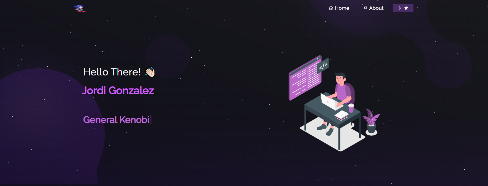
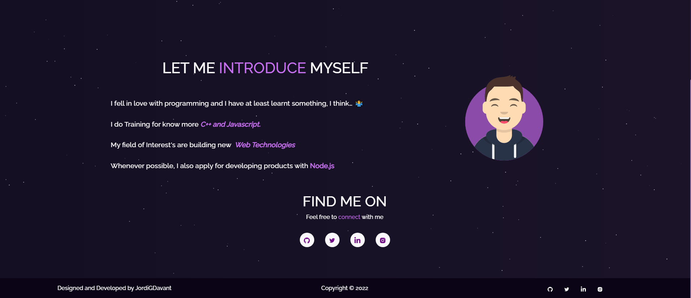
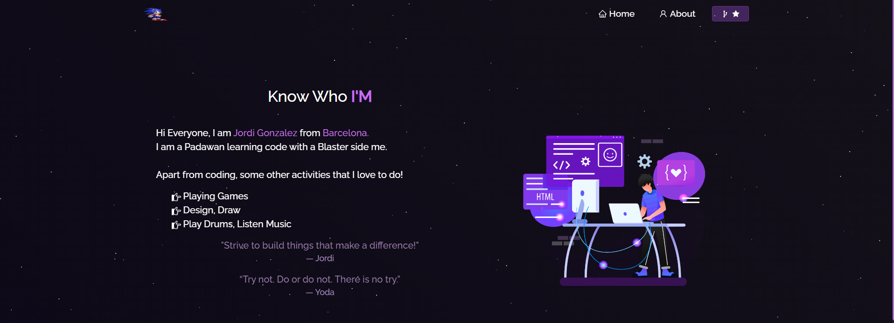
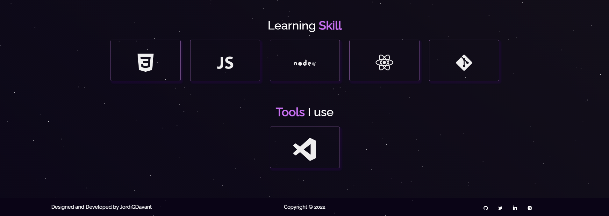

# Portafolio
Presentación de Página web.

# Home

Esto sería el Home de la página, Y 2 secciones que serian la Presentación y Biografía corta de mí. En la navbar hay accesos rápidos sobre el About me y un Link al Repositorio de Git.

En el Footer supuesto Copyright y Links a redes que de momento solo está el de Git y Twitter porque son los únicos que tengo.

# About me

Tenemos un Descripción mejor sobre mí donde tenemos 2 secciones que son una, la parte about que está compuesto por 2 componentes separados.

Y otro por Cajas que contienen Información de lo que aprendo y he usado.
